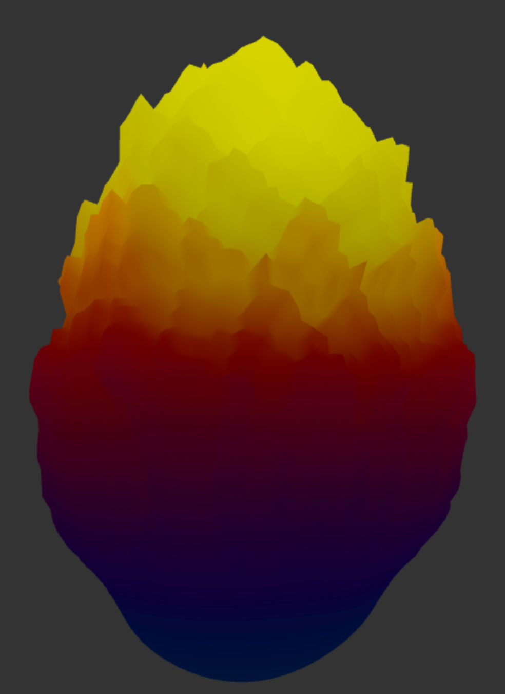
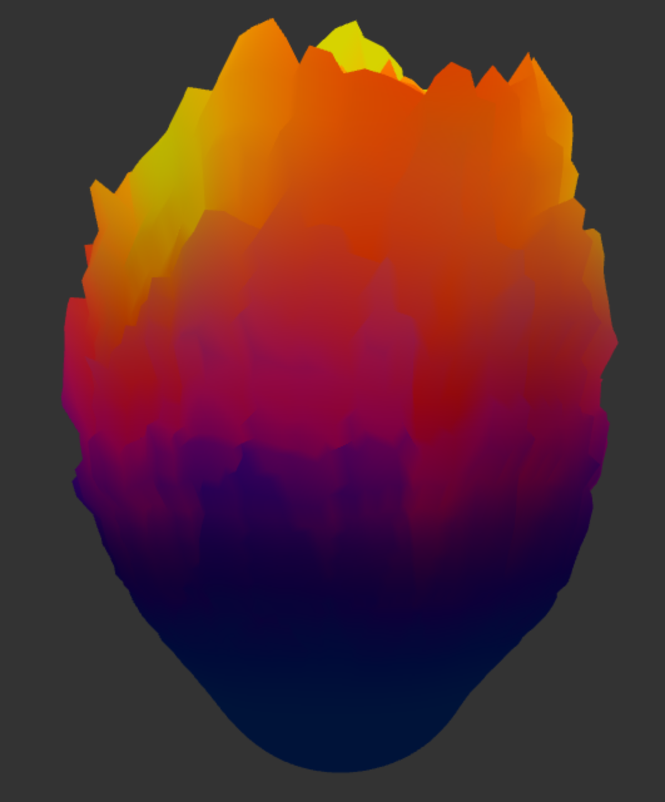
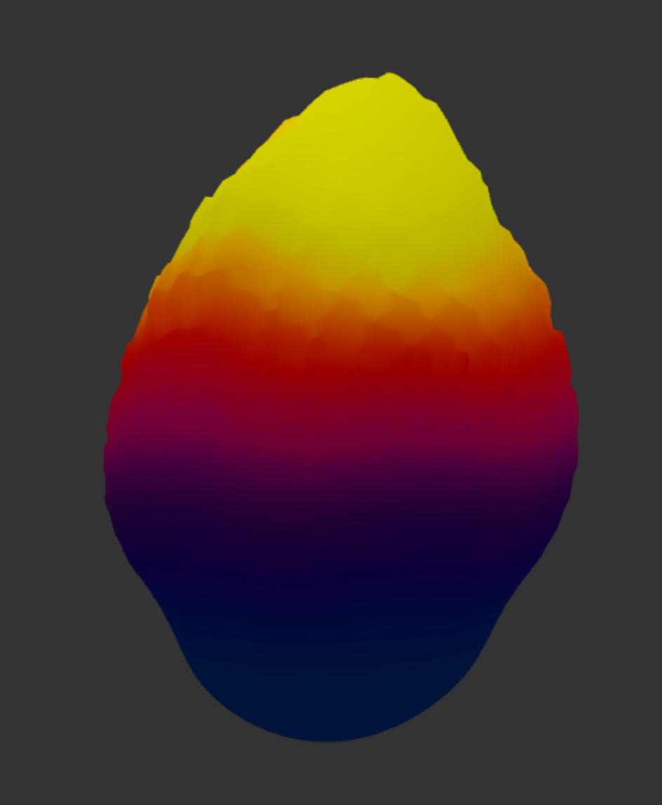
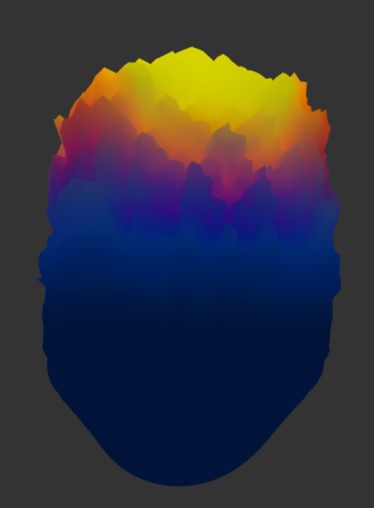

# HW 1: Fireball

* Jacob Mollot

  

### Process

I started with the provided icosphere and deformed its vertices in the vertex shader to create the fireball. A coarse, time-varying displacement gives the surface its overall motion, while a finer layer built from multiple frequencies of a modified sinc function adds jagged detail near the top. I also pull vertices toward a point above the sphere to shape the flame and add overlapping upward pulses at randomized positions, making individual flames rise and subside. For the color, I created a cosine gradient using [thi.ng's gradient tool](https://dev.thi.ng/gradients/) and blended position-based and noise-based colors to connect the appearance to the deformation. I referenced [Inigo Quilez's website](https://iquilezles.org/) heavily for the shaping and impulse functions.

### Controls

* **Grow:** Increases the size of the flame.

  

    
  

* **Relax:** Makes the flame less jagged and smoother.

  

    
  

* **Heat:** Adds more blue to the color, giving the flame a hotter appearance.

  

    
  

* **Note:** I am using my two lates days for this assignment (talked to the professors about this).

### Live Link:
https://jamollo.github.io/Jacob_Mollot-hw01-fireball/
